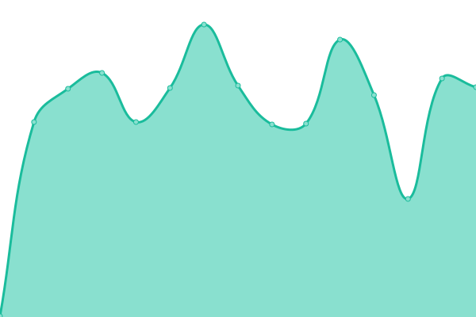

# [📈 Live Status](https://upptime.github.io/upptime): <!--live status--> **🟩 All systems operational**

This repository contains the open-source uptime monitor and status page for [Upptime](https://upptime.js.org), powered by [Upptime](https://github.com/upptime/upptime).

With [Upptime](https://upptime.js.org), you can get your own unlimited and free uptime monitor and status page, powered entirely by a GitHub repository. We use [Issues](https://github.com/upptime/upptime/issues) as incident reports, [Actions](https://github.com/duruapp/upptime/actions) as uptime monitors, and [Pages](https://upptime.github.io/upptime) for the status page.

<!--start: status pages-->
<!-- This summary is generated by Upptime (https://github.com/upptime/upptime) -->
<!-- Do not edit this manually, your changes will be overwritten -->
<!-- prettier-ignore -->
| URL | Status | History | Response Time | Uptime |
| --- | ------ | ------- | ------------- | ------ |
|  [Duru App Hosting](https://go.duru.app) | 🟩 Up | [duru-app-hosting.yml](https://github.com/duruApp/upptime/commits/HEAD/history/duru-app-hosting.yml) | 

 1299ms
     
 | 

<a href="https://status.duru.app/history/duru-app-hosting">100.00%</a>
    

|  [Duru API](https://duru-backend-wut4zsxq6q-nw.a.run.app/status) | 🟩 Up | [duru-api.yml](https://github.com/duruApp/upptime/commits/HEAD/history/duru-api.yml) | 

 209ms
     
 | 

<a href="https://status.duru.app/history/duru-api">100.00%</a>
    

|  [Duru Databases](https://duru-backend-wut4zsxq6q-nw.a.run.app/status/database) | 🟩 Up | [duru-databases.yml](https://github.com/duruApp/upptime/commits/HEAD/history/duru-databases.yml) | 

 203ms
     
 | 

<a href="https://status.duru.app/history/duru-databases">100.00%</a>
    

|  [Duru Realtime Databases](https://duru-backend-wut4zsxq6q-nw.a.run.app/status/realtime_database) | 🟩 Up | [duru-realtime-databases.yml](https://github.com/duruApp/upptime/commits/HEAD/history/duru-realtime-databases.yml) | 

 187ms
     
 | 

<a href="https://status.duru.app/history/duru-realtime-databases">100.00%</a>
    

|  [Duru Telephony Services](https://duru-backend-wut4zsxq6q-nw.a.run.app/status/telephony) | 🟩 Up | [duru-telephony-services.yml](https://github.com/duruApp/upptime/commits/HEAD/history/duru-telephony-services.yml) | 

 346ms
     
 | 

<a href="https://status.duru.app/history/duru-telephony-services">100.00%</a>
    

|  [Duru AI Services](https://duru-backend-wut4zsxq6q-nw.a.run.app/status/ai) | 🟩 Up | [duru-ai-services.yml](https://github.com/duruApp/upptime/commits/HEAD/history/duru-ai-services.yml) | 

 244ms
     
 | 

<a href="https://status.duru.app/history/duru-ai-services">100.00%</a>
    

<!--end: status pages-->

[**Visit our status website →**](https://upptime.github.io/upptime)

## 📄 License

- Powered by: [Upptime](https://github.com/upptime/upptime)
- Code: [MIT](./LICENSE) © [Anand Chowdhary](https://anandchowdhary.com), supported by [Pabio](https://pabio.com)
- Data in the `./history` directory: [Open Database License](https://opendatacommons.org/licenses/odbl/1-0/)
